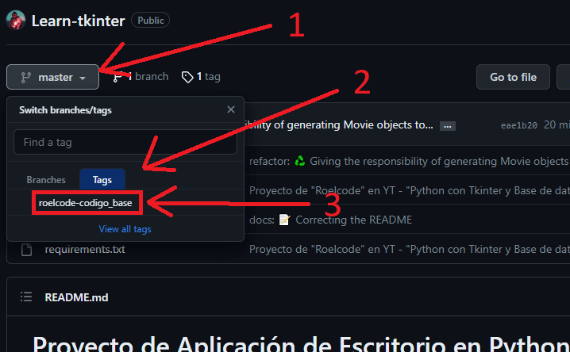

# Proyecto de Aplicación de Escritorio en Python con Tkinter y Base de Datos

Este proyecto consiste en una aplicación de escritorio desarrollada en Python utilizando la biblioteca Tkinter para la interfaz gráfica y una base de datos para gestionar un catálogo de películas. A través de esta aplicación, los usuarios podrán realizar diversas acciones relacionadas con la administración de películas, como agregar, editar, eliminar y visualizar información sobre películas.

## Introducción

Esta aplicación de escritorio se basa en el tutorial de _YouTube_ creado por **Roelcode**. En este tutorial, **Roelcode** aborda una serie de temas esenciales para el desarrollo de aplicaciones de escritorio utilizando Python y Tkinter, así como la integración de una base de datos para el almacenamiento y gestión de datos relacionados con películas.

## Agradecimiento

Me gustaria expresar un sincero agradecimiento a **Roelcode** por crear y compartir el tutorial. Su video tutorial _"Python con Tkinter y Base de Datos - Aplicación de escritorio (Catalogo de Peliculas)"_ fue una increible guia, la cual me permitió aprender y comprender los conceptos fundamentales detrás del desarrollo de aplicaciones de escritorio con Python y Tkinter, así como la implementación de características clave como la conexión a una base de datos, la creación de tablas y la implementación de operaciones CRUD (Crear, Leer, Actualizar, Eliminar) en Python y con el paquete 'sqlite3'.

- **Youtuber:** Roelcode.
- **Nombre del Video:** "Python con Tkinter y Base de Datos - Aplicación de escritorio (Catalogo de Peliculas)".
- **Link al video en YouTube:** [Ver tutorial](https://www.youtube.com/watch?v=7QqDQEZ3FTI).

## Temas del Video Tutorial

Estos son los temas esenciales relacionados con el desarrollo de aplicaciones de escritorio con Python y Tkinter dados en el tutorial:

1. Entorno Virtual (paquete 'venv').
2. Creación de la Interfaz Inicial con Tkinter.
3. Uso de Frames para la Organización de la Interfaz.
4. Implementación de una Barra de Menú.
5. Uso de Etiquetas (Labels) para Mostrar Información.
6. Utilización de Entrys para la Entrada de Datos.
7. Creación y Funcionalidad de Botones.
8. Uso de StringVar para la Gestión de Variables.
9. Implementación de Treeview para Visualización de Datos (tablas).
10. Conexión a una Base de Datos (paquete 'sqlite3').
11. Creación de Tablas en la Base de Datos desde Python.
12. Uso de MessageBox para Mensajes Emergentes.
13. Operaciones CRUD (Crear, Leer, Actualizar, Eliminar).
14. Implementación de Scrollbar para Contenido Desbordado en la tabla.
15. Creación de un Ejecutable para la Aplicación (paquete "pyinstaller").

# Cómo Obtener/Clonar el Código Base (?)

> **Nota:** Es importante mencionar que el código base no coincide exactamente con el código presentado en el video tutorial. Esto se debe a que no tuve acceso directo al código del tutorial original. Como resultado, podrás notar algunas pequeñas diferencias, como cambios en los nombres de variables, archivos y carpetas. Además, en lugar de utilizar rutas directas, he implementado el paquete 'os' para obtener las rutas, ya que esto solucionó algunos problemas que encontré durante el proceso. Estas adaptaciones se hicieron para asegurar la funcionalidad y coherencia del proyecto, y garantizar que puedas trabajar con una base sólida para tus propias modificaciones. ¡Espero que encuentres este código base útil y un buen punto de partida para tus desarrollos!


## Cómo Ver y Descargar el Código en Formato ZIP

Si deseas revisar el código base y descargarlo en formato ZIP, sigue estos pasos sencillos:

1. Dirígete a la parte superior del repositorio y haz clic en el botón que dice "master". Esto abrirá un menú desplegable.

2. En el menú desplegable, selecciona la opción "tags".

3. Busca y haz clic en el tag "roelcode-codigo_base".

Los pasos anteriores se ilustran en la siguiente imagen:



> **Nota:** En este momento ya podrás ver el código base del proyecto, es decir, el código del tutorial de **Roelcode**. Si no deseas descargarlo en formato ZIP, puedes omitir los siguientes pasos.

4. Busca el botón verde con el texto "<> Code" en la misma barra donde se encontraba el botón "master" que presionaste anteriormente.

5. Haz clic en el botón "<> Code". Se abrirá un menú desplegable.

6. En el menú desplegable, selecciona "Download ZIP".

Siguiendo estos pasos, podrás acceder al código base en el estado correspondiente al tag "roelcode-codigo_base" y descargarlo en formato ZIP para tu conveniencia.

## Clonar solo el codigo base

Si deseas clonar el codigo base de este repositorio, codigo basado en el tutorial de **Roelcode** , sigue estos pasos:

1. **Abre tu terminal o línea de comandos.**

2. **Ejecuta el siguiente comando para clonar el repositorio usando el tag "roelcode-codigo_base":**

```bash
git clone --branch roelcode-codigo_base --depth 1 https://github.com/JuppLCD/Learn-tkinter.git
```

> **Info del comando:**
>
> - `git clone`: Es el comando básico de Git para clonar (copiar) un repositorio.
> - `--branch roelcode-codigo_base`: Este argumento indica que se debe clonar una rama específica del repositorio (en este caso en realidad es un tag que se llama "roelcode-codigo_base"). Esto significa que solo se clonará el contenido de dicho tag y no todo el repositorio.
> - `--depth 1`: Este argumento limita la clonación a la profundidad de historial de 1 commit. Esto significa que solo se clonará el commit más reciente y su contenido.
> - `https://github.com/JuppLCD/Learn-tkinter.git`: Esta es la URL del repositorio que deseas clonar desde GitHub.
>
> En resumen, el comando completo realiza una clonación limitada y específica del repositorio "Learn-tkinter" en el tag "roelcode-codigo_base" desde GitHub, descargando solo el commit más reciente y su contenido.

3.  **Una vez que el repositorio haya sido clonado, ingresa al directorio del repositorio:**

```bash
cd Learn-tkinter
```

# Entorno Virtual

Sigue estos pasos para crear e instalar los paquetes necesarios en el entorno virtual:

1. **Creación del Entorno Virtual:**

   Ejecuta el siguiente comando para crear un entorno virtual en el directorio de tu proyecto:

   ```bash
   python -m venv env
   ```

   Esto establecerá un entorno virtual llamado "env".

2. **Activación del Entorno Virtual (Windows):**

   Para activar el entorno virtual en Windows, usa el siguiente comando:

   ```bash
   env\Scripts\activate.bat
   ```

   Una vez activado, verás que el nombre del entorno virtual se muestra en el prompt de la terminal.

3. **Instalación de Paquetes con `requirements.txt`:**

   Con el entorno virtual activado, instala los paquetes necesarios enumerados en el archivo `requirements.txt` mediante el siguiente comando:

   ```bash
   python -m pip install -r requirements.txt
   ```

   Esto asegurará que todos los paquetes necesarios para tu aplicación se instalen en el entorno virtual creado.

El uso de un entorno virtual te permitirá manejar las dependencias de tu proyecto de manera independiente, evitando conflictos entre paquetes y asegurando un ambiente controlado y limpio para tu aplicación.

# Empaquetado con 'PyInstaller'

Si deseas empaquetar la aplicación en un archivo ejecutable utilizando PyInstaller, aquí están los pasos necesarios para lograrlo:

1. **Creación del archivo '.spec'**

   Para empaquetar la aplicación, primero debes crear un archivo `.spec`. Este archivo se utiliza para indicar a PyInstaller qué carpetas deben incluirse en el paquete (estas contienen archivos estaticos). Para crear el archivo `.spec`, utiliza los siguientes comandos en la terminal:

   ```bash
   pyi-makespec app/app.py --windowed
   ```

2. **Modificar el archivo '.spec'**

   Una vez generado el archivo `app.spec`, debes abrirlo y modificar la variable `a` (objeto `Analysis`). En el parámetro `datas`, agrega en el array la siguiente línea: `[('app/imgs/*.ico', 'imgs'), ('app/db/*.db', 'db')]`. Debería lucir de esta manera:

   ```python
   a = Analysis(
    ['app\\app.py'],
    pathex=[],
    binaries=[],
    datas=[('app/imgs/*.ico', 'imgs'), ('app/db/*.db', 'db')], # Codigo a añadir
    hiddenimports=[],
    hookspath=[],
    hooksconfig={},
    runtime_hooks=[],
    excludes=[],
    win_no_prefer_redirects=False,
    win_private_assemblies=False,
    cipher=block_cipher,
    noarchive=False,
   )
   ```

3. **Ejecuta la Aplicación**
   Este paso es necesario para que el paquete 'sqlite3' genere el archivo `*.db` en la carpeta `db/` (si no se hace tira error al empaquetar al no encontrar ningun archivo `*.db`).

4. **Empaquetar la Aplicación**

   Con todo configurado, puedes empaquetar la aplicación utilizando el siguiente comando en la terminal:

   ```bash
   pyinstaller app.spec
   ```

5. **Utilizar la Aplicación Empaquetada**

   La aplicación empaquetada se generará en la carpeta `dist/app`, lista para ser utilizada. Para ejecutarla, simplemente haz clic en el archivo `app.exe`.

Al seguir estos pasos, habrás empaquetado tu aplicación en un archivo ejecutable utilizando PyInstaller. Este proceso garantiza que todos los recursos necesarios, como las imágenes del icono de la aplicación y la base de datos SQLite, estén incluidos en el paquete. Ahora tu aplicación está lista para ser distribuida y utilizada por otros usuarios.
